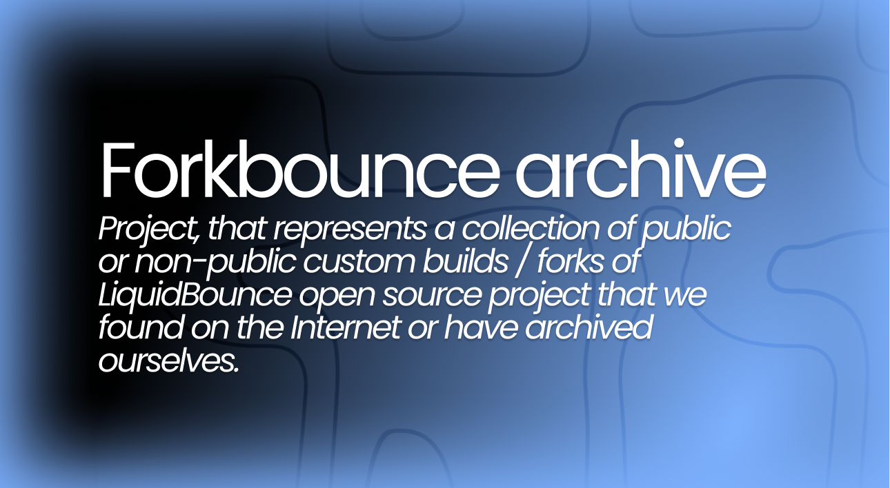

### Warnings, please read before downloading.

#### License warning

 Please notice that the original LiquidBounce project is publicized and licensed under GPLv3, \
 which does **NOT** allow anyone to **sell/distribute** softwares without **disclosing their source code**.
 
Original LiquidBounce GitHub repository: https://github.com/CCBlueX/LiquidBounce \
GNU General Public License version 3: https://www.gnu.org/licenses/gpl-3.0.en.html \
If you see there any **closed source code** liquidbounce fork there, it **doesn't means** we support it development.

#### Malware warning
The forks / custom builds of LiquidBounce project may contain **malware**, **trojans**, or **R.A.T.** (Remote Access Trojan) that can be hidden using obfuscation techniques.\
 If you found something in one of this custom builds / forks, please create issue in this repository or contact with me.\
Please don't send proofs like VirusTotal scan or other AV, they ofthen have false detections. \
Please send screenshot of source with malware code

### Issues

If you have some issues with one of this custom bulds, please create issue in this repository. \
Or you can contact to us by [discord](https://dsc.gg/selenite)

### Contributing

How you can contribute to ForkBounce Archive:
- You can contact to us by discord server.
- You can fork this repository, do some changes and make pull request to this repository.
- You can make issue in this repository and write suggestion to add any custom build.

### Terminology

The forks of the Liquidbounce Project can be referred to in language as:

- Custom build of Liquidbounce
- Liquidbounce skid (less commonly used)
